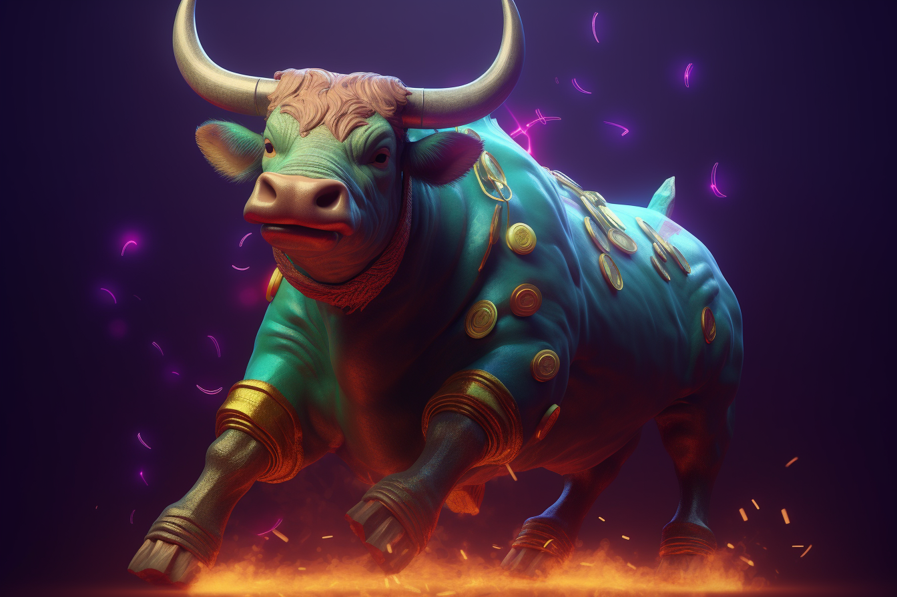

# 💼 Fees

<figure><figcaption></figcaption></figure>

**BullishPepe, a crypto token created by the visionary BullishPepe, has a unique fee structure that sets it apart from other cryptocurrencies on the Binance Smart Chain ecosystem. When users transact with BullishPepe, they are charged a total fee of **<mark style="color:green;">**8%**</mark>**. This fee is automatically split into three portions, with **<mark style="color:green;">**4%**</mark>** going towards rewarding holders, **<mark style="color:green;">**2%**</mark>** being allocated for marketing purposes, and the final **<mark style="color:green;">**2%**</mark>** being used to maintain liquidity for the token's buyers and sellers. The 4% reward fee is a distinct feature that incentivizes users to hold onto their tokens for a more extended period, which can help increase the token's overall value. Investors will receive these **<mark style="color:green;">**rewards automatically**</mark>**, and the more BullishPepe tokens they hold, the more rewards they will receive. The **<mark style="color:green;">**2% marketing**</mark>** fee is crucial to maintaining the token's image and keeping investors informed about the project's progress. It ensures that the BullishPepe team can conduct extensive marketing campaigns, which can help increase demand for the token and attract new investors to the community. The final 2% fee is allocated towards liquidity, which ensures that buyers and sellers can quickly and easily trade BullishPepe tokens without causing significant price fluctuations. This feature is especially important in ensuring a positive experience for investors and creating a stable and reliable investment option. Overall, BullishPepe's unique fee structure shows that the creators of the token are dedicated to promoting the success of the project and its users. By incorporating features that benefit all stakeholders, BullishPepe is poised to be a major player in the world of crypto and a valuable addition to the Binance Smart Chain ecosystem.**
