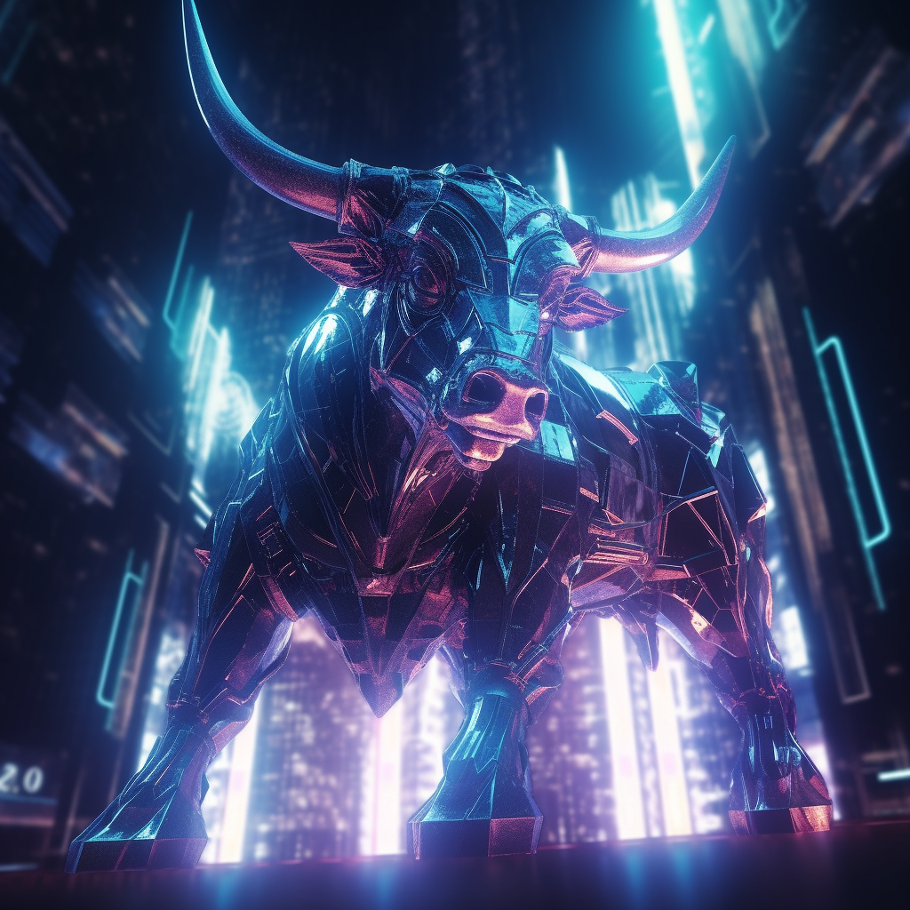

# 🤝 Safu Contract and Partnership

<figure><figcaption></figcaption></figure>

**The **<mark style="color:green;">**100% SAFU contract**</mark>** is a significant feature that sets BullishPepe apart from other meme tokens in the market, which may not have implemented the same level of security and protection for their holders. By assuring users of the safety and security of their investments, the token becomes more attractive to potential investors and traders. Ultimately, this can drive up demand for the token and result in increased value and profits for holders**

**The team behind BullishPepe is confident in their vision of a community-driven meme token that is both fun and profitable. They have partnered with renowned platforms such as **<mark style="color:green;">**Pinksale**</mark>**, **<mark style="color:green;">**PancakeSwap, Binance, Dexview,**</mark>** and **<mark style="color:green;">**Coinmarketcap**</mark>**, marking significant milestones in the journey of BullishPepe. By partnering with these platforms, BullishPepe has gained access to a vast community of **<mark style="color:green;">**investors**</mark>**, **<mark style="color:green;">**traders**</mark>**, and **<mark style="color:green;">**crypto enthusiasts**</mark>**. The team behind BullishPepe believes that they have what it takes to be the next big thing in the competitive crypto market, and they invite others to join the revolution and be a part of the BullishPepe community. By holding onto the BullishPepe token, investors can participate in the exciting journey of the BSC ecosystem's next big thing, contribute to its growth, and earn profits at the same time.**
